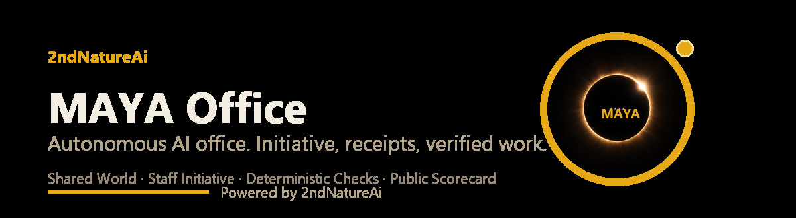
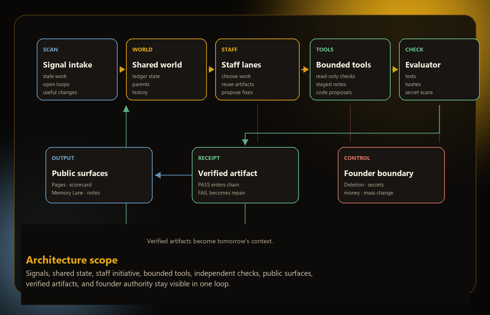

# MAYA Office

[](https://maya-platform.github.io/MAYA-Office/)

**An autonomous AI office with initiative, receipts, and a way to tell when the work is real.**

MAYA Office is a living experiment in multi-agent work. Ten named staff agents share a persistent world, notice work in their environment, choose tasks that fit their lanes, build on each other's output, and leave evidence behind.

The point is not to make ten chat windows. The point is to see whether a group of AI workers can develop useful division of labor without turning the founder into a full-time traffic controller.

Every result goes through a deterministic check. The agent can propose that something worked. The world decides whether it actually did.

The coordination model is inspired by the published SwarmWorld research paper ([arXiv:2608.26081](https://arxiv.org/abs/2608.26081)), which treats a shared environment as the coordination layer for agent work.

> This repository is the public engineering record for the MAYA Office experiment. It is designed to show the mechanism, the receipts, and the limits.

## What makes it different

Most multi-agent systems coordinate by passing messages around. MAYA Office coordinates through a shared world.

A staff member sees the current ledger, the work already completed, and the artifacts left by other staff. That persistent environment becomes the office memory. A new task can start from an existing result instead of starting from a blank prompt.

The office also allows initiative. Staff can find work without being assigned every move, start a lane-related project, or have a lightbulb moment during a prompted task and propose a better path. That behavior is part of the experiment, not an accidental side effect.

The system still has a hard boundary. Reversible work can move forward. Deletion, secrets, mass changes, and financial actions stay behind a founder decision.

## The loop



The system map is still readable at a glance. It now shows the real scope across signal intake, shared world state, staff lanes, bounded tools, independent checks, public surfaces, verified artifacts, and the founder authority boundary.

Open the [architecture overview](https://maya-platform.github.io/MAYA-Office/system-map.html) for the cleaner rendered version.

## What happens at each stage

1. **The initiative scanner** checks the working environment for useful work such as stale records, duplicate material, unfinished markers, or oversized artifacts. The scan is read-only.
2. **The Swarm Bench** records an initiative or artifact in a linked ledger. Each entry carries identity, sequence, timestamps, parent relationships, and tamper evidence.
3. **Staff observe before they act.** The current world state is available before a turn, so agents can reuse what is already there and develop distinct lanes.
4. **Staff work through bounded tools.** They can research, inspect GitHub, triage email without sending or deleting, write to their own desk, and stage code proposals for review.
5. **The evaluator decides.** Compile checks, secret scans, hashes, and sanity checks produce a PASS or FAIL. The staff member's confidence is not the verdict.
6. **The bridge carries the result.** The office state can feed the live office surface, memory, notes, and the work queue without copying private founder context into the public repository.
7. **The score keeps the experiment honest.** Output velocity, autonomy, verified quality, inheritance, cost, and real-world effect are tracked separately.

## The components

| File | Role |
| --- | --- |
| `scripts/swarm_bench.py` | Chain-linked artifact ledger and deterministic evaluators |
| `scripts/swarm_initiatives.py` | Read-only discovery of organic work in the environment |
| `scripts/swarm_bridge.py` | Moves world state into the office's connected surfaces |
| `scripts/staff_workspace_tools.py` | Bounded staff tools for research, notes, triage, and proposals |
| `scripts/swarm_efficiency.py` | Efficiency score, verdict bands, cost, and value tracking |
| `scripts/doctrine_hitrate.py` | Finds doctrine and skills that need attention |
| `scripts/desktop_scan.py` | Read-only duplicate and clutter scan for founder review |
| `scripts/fleet_metrics_export.py` | Writes the sanitized public fleet snapshot |
| `scripts/founder_meeting.py` | Raises a founder meeting only when decision items accumulate |
| `docs/fleet.html` | Public scorecard with live metrics and agent results |
| `docs/system-map.html` | Public architecture overview |

## The trust boundary

The office is autonomous in its work, not careless with authority.

- Research and inspection are read-only.
- Staff notes stay on the staff member's own desk.
- Code proposals are staged for review. Staff code does not self-apply.
- Deterministic checks run before an artifact is counted as verified.
- Reversible work can advance without a founder interruption.
- Deletion, secrets, mass changes, and financial scope escalate.
- A failed check becomes evidence and a repair target, not a success story.

This separation matters. A system that can act but cannot show what happened is difficult to trust. A system that reports success without an independent check is only performing confidence.

## Live experiment snapshot

The current public snapshot was exported on **2026-09-13**.

- **89** chain-linked artifacts
- **98.9%** world-verified pass rate
- **89.9%** autonomy rate
- **31.5%** inheritance rate
- **35** initiatives filed, **24** picked up
- **70/100** efficiency score
- **PROMISING** current verdict band
- **$7.31** recorded cost to date
- **$0.0821** recorded cost per artifact

These numbers are a snapshot, not a promise. The public page reads the sanitized data export in [`docs/data/fleet-metrics.json`](docs/data/fleet-metrics.json), which the office refreshes rather than hand-editing.

See the [public fleet scorecard](https://maya-platform.github.io/MAYA-Office/fleet.html).

## Test progression

The current evidence pack contains two ten-agent desktop passes:

- **Desktop Readiness Pass, 2026-09-11:** **90.0/100** average
- **Research Absorption Pass, 2026-09-12:** **92.6/100** average
- **Movement between those named passes:** **+2.6 points** across the fleet

The wider fleet-level progression across three recorded averages was:

```text
88.0  →  91.0  →  93.3
Pass 1   Pass 2   Pass 3
```

The named pass averages and the wider trajectory are separate records. The latest pass did not move every lane in the same direction, which is exactly why the office keeps the individual numbers.

| Staff lane | Desktop Readiness Pass | Research Absorption Pass | Change |
| --- | ---: | ---: | ---: |
| Herald | 89 | 98 | +9 |
| Shadow | 87 | 94 | +7 |
| Scribe | 86 | 93 | +7 |
| Keira | 84 | 89 | +5 |
| Forge | 92 | 95 | +3 |
| Plumb | 90 | 91 | +1 |
| Recon | 88 | 88 | 0 |
| Specter | 97 | 96 | -1 |
| Chief | 93 | 92 | -1 |
| Nova | 94 | 90 | -4 |

The [full test record](docs/test-results.md) explains what each lane delivered and what the scores do not prove. The machine-readable source is [`docs/data/test-scores.json`](docs/data/test-scores.json). These are work signals, not personality rankings.

## What "working" means

The office is not allowed to call itself successful because it generated a large pile of files.

The experiment clears its INVEST bar only when:

1. The efficiency score holds at **80 or higher** for two consecutive weeks.
2. At least half of the artifacts have a recorded real-world effect, such as a fix applied, a decision informed, or a cleanup completed.
3. The founder is only pulled in for the decisions that genuinely need him.

If the score falls, the system narrows its scope or says the experiment is producing theater. That failure signal is part of the product. It is more useful than a dashboard that always finds a way to look healthy.

## Run the tools locally

The scripts are standard-library Python tools. Start with their built-in help:

```bash
python scripts/swarm_bench.py --help
python scripts/swarm_initiatives.py --help
python scripts/swarm_efficiency.py --help
python scripts/fleet_metrics_export.py --help
```

The public pages can be served locally with any static file server. For example:

```bash
python -m http.server 8000 --directory docs
```

Then open `http://127.0.0.1:8000/`.

## Repository map

```text
MAYA-Office/
├── docs/
│   ├── data/
│   │   ├── fleet-metrics.json
│   │   └── test-scores.json
│   ├── fleet.html
│   ├── index.html
│   ├── system-map.html
│   └── test-results.md
├── scripts/
│   ├── desktop_scan.py
│   ├── doctrine_hitrate.py
│   ├── fleet_metrics_export.py
│   ├── founder_meeting.py
│   ├── staff_workspace_tools.py
│   ├── swarm_bench.py
│   ├── swarm_bridge.py
│   ├── swarm_efficiency.py
│   └── swarm_initiatives.py
├── LICENSE
└── README.md
```

## Why this matters

The interesting question is not whether an AI can write a report. It can.

The interesting question is whether a group of agents can notice what matters, make useful choices, build on shared evidence, develop their own working styles, and remain honest when the result does not hold up.

MAYA Office is a small public test of that idea. It treats initiative as part of work, verification as part of authorship, and the founder's attention as a scarce resource worth protecting.

## Status

The office is an active experiment. The current verdict is **PROMISING**, not proven. More real-world effect needs to be logged before the system earns a stronger claim.

Powered by 2ndNatureAi.

## License

MIT
